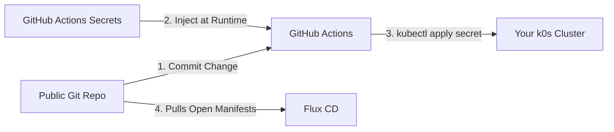

# DevOps Assignment Draft

Drafting of the Assignment collateral.

## [Contents](#contents)

- [Assessment Ideation](#assessment-ideation)
- [Summative Draft](#summative-draft)
  - [Introduction](#introduction)
  - [Technical Pipeline and Process Design](#technical-pipeline-and-process-design)
  - [Appraisal against Business Context](#appraisal-against-business-context)
  - [Appraisal of Business DevOps Integration](#appraisal-of-business-devops-integration)

## [Assessment Requirements](#contents)

Refer to [Assessment Brief](/bpp_module6_project/Assessment%20Brief%20DevOps.docx).

"You should create a small **web application**. The specifics of the application are unimportant other than that you should consider the technology in order to fully meet the assessment criteria.

You should **deploy** the web application using a **CI/CD pipeline** including **provision of the infrastructure**."

**Deploy**

- Automated deployment of something with tools.
- Deploy anything, a web app.
  - Could literally just be TradeStream UI.
- Use of Docker would count as infrastructure

**CI/CD pipeline**

- Some tooling.

**Provision of the infrastructure**

- Provisioning environments (with resources) is traditionally an Ops job.
  - Might have more than one environment.
- Us of Docker considered "Provisioning Infra".
  - Guessing this with relation to declaring the containers.
  - k8s yaml would be equivalent.
- Expecting use of **Terraform** to define and provision a VM.

## [Assessment Ideation](#contents)

### [Practical - API Idea](#contents)

**25% of marks.**

Maybe work backwards to automate the whole stack.

Only need to go as far as host needed for the app. So when containerised, that would be the image guest host, not the need to specify the Ubuntu-Server host for the VM that is hosting the k0s runtime for deployment of the pods.

Proxmox, the Ubuntu-Server VM, and k0s as deployed to the VM are assumed to be provisioned by Ops.

Will only need to specify the pod image details, automated deployment with change to either the app code or the infra code.

Should have at least some tests.

- Deploy VM on Proxmox with Terraform.
- Install dependencies on VM.
  - Install git?
  - Possibly Ansible?
  - Maybe some other agent?
  - Install k0s on VM.
  - kubectl apply -f . <app files>

#### Bare-bones Example

This uses github actions. Not as good as Jenkins or Harness.

- <https://github.com/antonyleesbpp/docker-demo>

Between the action to pull the code and build the docker image it should do the CI stuff of tests etc.

The docker build is effectively the Continuous Delivery part, packaging.

Test is kind of Smoke Test, that checks for the word "Hello" spelt correctly. Poor test but demonstrates how this then fails the pipeline.

Incorporating role-back based on failed tests after deployment would be complex by great.

AWS has CodePipeline.

#### Current Pipeline

##### Infra

- GitHub - code repository
- DockerHub - image registry
- Dev Laptop
- Dev k0s vm on dev laptop
- proxmox vm for k0s cluster
- mini pc nodes
- pfsense
- cloudflare "cloudflared" tunnels
- zitadel - identity provider
- tailscale tailnet
- Vault (kubuntu)

##### Tools

- git
- docker
- k0s
- Ubuntu Virtual Machine Manager
- vscode
- bash
- proxmox
- SonarQube

##### Process

1. Clone code "main" branch from remote.
1. Create or checkout branch "dev".
1. Edit "dev" code branch.
1. Run in local environment to test new feature works.
1. Merge code branch "dev" > "main".
1. Push to remote.
1. Build image.
1. Push image to remote container registry.
1. ssh into server.
1. Pull "main" branch.
1. kubectl -f . apply

**N.B.** Could separate image code from k8s deployment code.

#### Target Pipeline

**Continuous Delivery:**


##### Infra

##### Tools

- Secure Secrets Management.
  - 
- git.
- SonarQube.
- Flux
  - Replaces the use of Jenkins.
  - Deployed to k0s cluster.
  - Monitors the GitRepo for changes.
  - Minimal footprint compared with ArgoCD.
    - No visual like ArgoCD, can use:
      - Weave GitOps
      - Podman Desktop/Lens
  - Flux integrates natively with SOPS (Secrets OCS) and Sealed Secrets. You can safely push encrypted database passwords or API tokens directly to a public or private GitHub repository. Flux will decrypt them inside the cluster using a private key, keeping your pipeline entirely automated.

#### Possible secrets management



##### Process

- Testing. Just a couple of indicative tests will do.
  - Security
    - Static Application Security Testing (SAST)
    - Dynamic Application Security Testing (DAST)
    - Interactive Application Security Testing (IAST)
  - Performance
    - Load Testing
    - Stress Testing
    - Endurance Testing
    - Spike Testing
- GitOps


#### Possible git folder structure

```Text
├── apps/
│   ├── base/                  # Core application manifests (Radarr, Nginx, Home Assistant)
│   └── overlays/
│       ├── dev-kubuntu/       # Development-specific tweaks
│       ├── test-proxmox/      # Test environment settings
│       └── prod-vultr/        # Production-grade scale and resources
├── infrastructure/            # Cluster-wide tools (Cert-Manager, MetalLB, Storage Classes)
└── clusters/
    ├── dev-kubuntu/           # Flux sync configurations pointing to dev overlay
    ├── test-proxmox/          # Flux sync configurations pointing to test overlay
    └── prod-vultr/            # Flux sync configurations pointing to prod overlay
```

### [Report - Design & Implementation Appraisal, Contextual Technical Appraisal, Contextual DevOps Appraisal](#contents)

**75% of marks.**

**Report:** A written report (maximum 2000 words) that discusses DevOps pipelines as a whole and in context of the pipeline(s) you have created and your organisation:

- **Technical Design Critique:** Defend your choices for the architecture, tools, and processes for your pipeline(s) in relation to your application and best practice.
  - **Contributes to:**
    - Design and architecture (40%)
    - DevOps concepts (35%)

- **Appraisal against Business Context:** Critically appraise the pipeline(s) you have created in the context of your role or organisation and use in your organisation and industry as a whole, including an assessment of the effectiveness of the pipeline.
  - Contributes to:
    - Design and architecture (40%)
    - Reflection on DevOps practice (25%)

- **Appraisal of Business DevOps Integration:** Consider how DevOps can be, or is, integrated into your organisation and appraise the success and challenges of this.
  - **Contributes to:**
    - DevOps concepts (35%)
    - Reflection on DevOps practice (25%)

### Following DORA

<https://dora.dev/guides/dora-metrics/>

Now Five Metrics:

- Throughput
  - Change lead time - Lead time for changes
  - Deployment Frequency
  - Failed deployment recovery time - Mean Time to Restore
- Instability
  - Change fail rate
  - Deployment rework rate

#### DevOps Security and Data Privacy

See Mod-1 Lecture slides.

### [Guidance Interpretation](#contents)

  - There should be a process that has been created. How has this been automated. Would have otherwise been manual.
    - What are the steps.

### [Pipeline](#contents)

**25% of marks.**

  Pull from git.
  Dev changes.
  Push to git.

  Packaged as images, pushed to docker repo.

#### What should pipeline be comprised of?

- Codebase.
- CI/CD?
  - Automated SAST/DAST?
  - Automated Testing?
    - Unit.
    - Integration.
    - Etc.
  - QA?
  - Deployment through different Environments?
  - GitHub Actions triggers on Pull Requests etc?
- Images in Container Registry?
- Kubernetes Manifest (.yaml)?
- Build agents?
  - Terraform?
  - Ansible?
- Secrets management/vault?
- Authentication?

### [Report](#contents)

**75% of marks.**

## [Summative Draft](#contents)

**75% of marks.**

**Report:** A written report (maximum 2000 words) that discusses DevOps pipelines as a whole and in context of the pipeline(s) you have created and your organisation.

### [Introduction](#contents)

DevOps is not just about tools. It is very importantly about culture and behaviours etc.

Ownership of the working application beyond when it has been deployed. Not having the "Wall of Confusion" where software is packaged and thrown over the wall to Ops.

Shared responsibility between Ops and Dev for:

- Release
- Monitor
- Support

#### Ethics

#### Key Considerations

- Transparency: Ensuring transparency in automated processes and AI decision-making.   
- Accountability: Establishing clear lines of accountability for automated actions.
- Fairness: Mitigating biases in AI and ensuring fair outcomes.   
- Sustainability: Minimizing the environmental impact of DevOps practices.   
- Collaboration: Fostering collaboration between development, operations, and security teams.

### [Technical Pipeline and Process Design](#contents)

**Defend your choices for the architecture, tools, and processes for your pipeline(s) in relation to your application and best practice.**

- How do the tools that have been chosen enable DevOps culture?
  - Automation.
  - Enabling more distributed cross-functional team capability (Architecture As Code).
    - [Calm](https://calm.finos.org/) framework.
- This solution may not be appropriate for LBG, which is fine.
  - Provides counterpoint for last section.
- What tools are being used and why?
- What processes need to be embedded and why?
- How much is automated, and should be, and why?
- How are security concerns addressed?
  - What other factors need to be addressed?
  - Is this all being done safe?
    - Appropriate safety over speed.

- Why built/designed what built, was it worth it?

### [Appraisal against Business Context](#contents)

**Critically appraise the pipeline(s) you have created in the context of your role or organisation and use in your organisation and industry as a whole, including an assessment of the effectiveness of the pipeline.**

#### CI/CD/CD Pipelines

CI - Integration (Testing, QA)
CD - Delivery (Git Repo, DockerHub, Container Registry)
CD - Deploy (Make available for end users, running on server)

#### IaC

- Infrastructure as what system will work on.
- Have somewhere to have software run.
- Provision environment and runtime dependencies etc.

### [Appraisal of Business DevOps Integration](#contents)

**Consider how DevOps can be, or is, integrated into your organisation and appraise the success and challenges of this.**

- IDP being implemented.
  - Becoming the GitOps authoritative source of the truth.
  - Use of Architecture As Code using [Calm](https://calm.finos.org/).
- Jira & jira Align.
- We do not have Continuous Deployment.
  - Heavily scheduled and orchestrated.
- Security of automated processes.
  - Increase of attack surfaces with the integration of DevOps tools, service agents, etc.
- Need for continuous change, not one-and-done.
  - Will likely need to adapt and adjust once first iteration of DevOps practices are implemented.
  - Reference to the 5 year platform change plan 1.0, 2.0, 3.0 etc.
    - Avoid Stagnation and Resistance to change.
    - Culture first, Tools second.